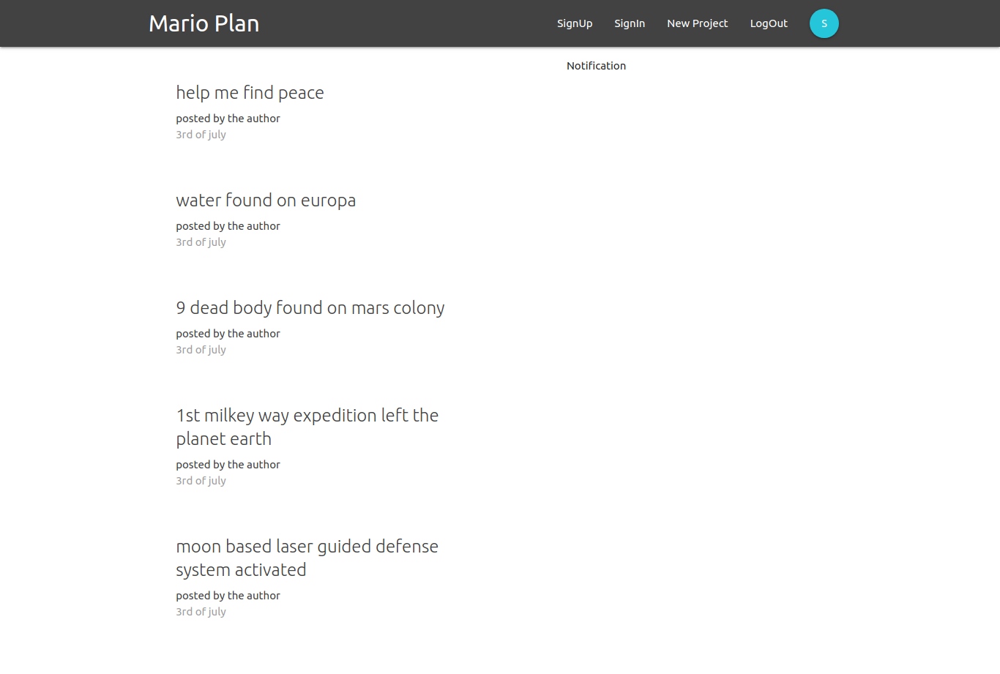
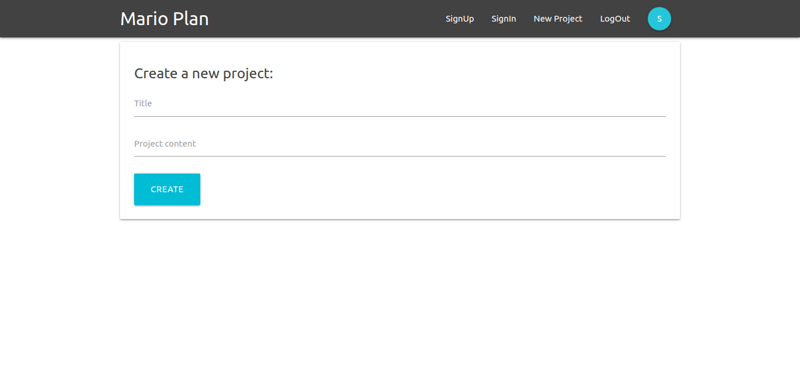
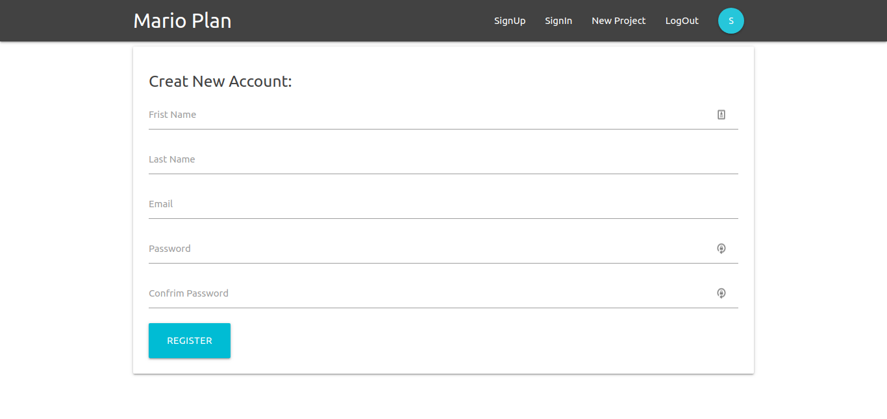
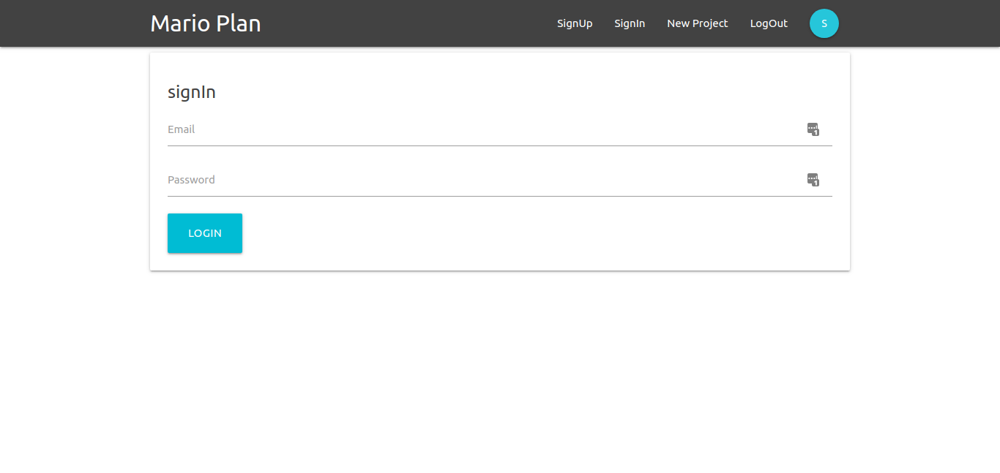

# This is a project manager demo app created with React, redux and firebase.

## Home page

## Create a New Project

## Create a New Account 

## Login page

to work on this project all you have to do is fork this project or clone it to your desktop
cd into the project directory and then run =>
### yarn install or npm install 
from your terminal
